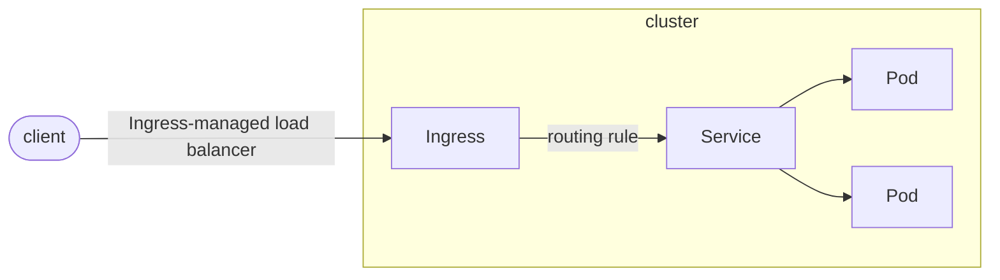
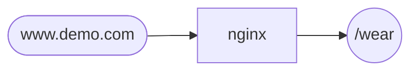
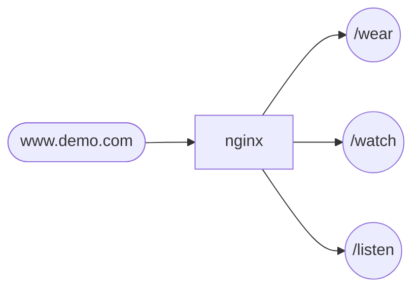
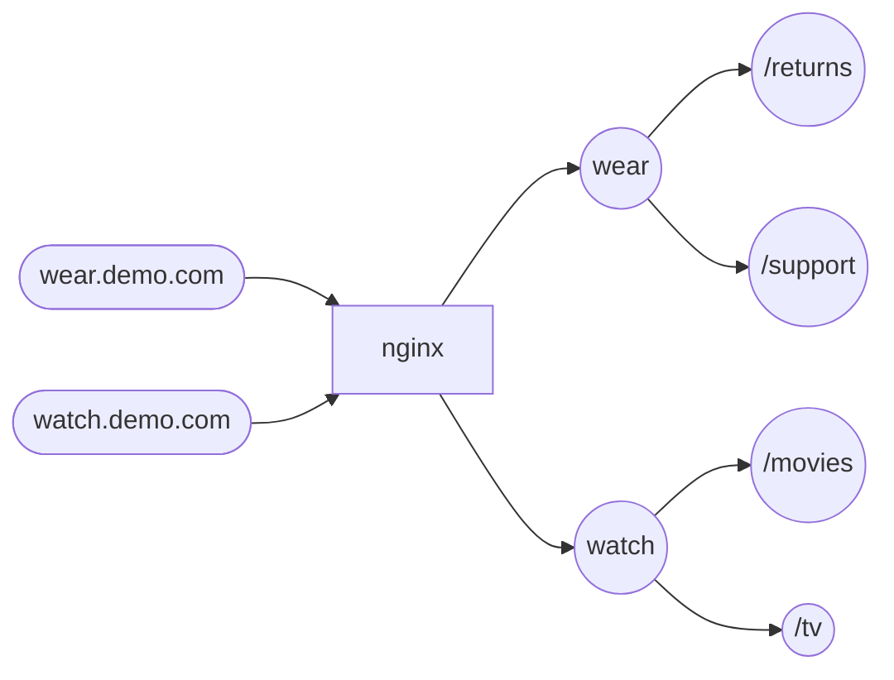
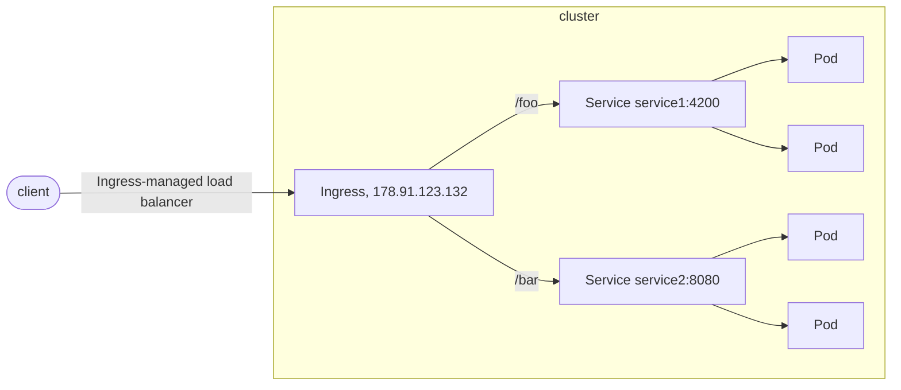
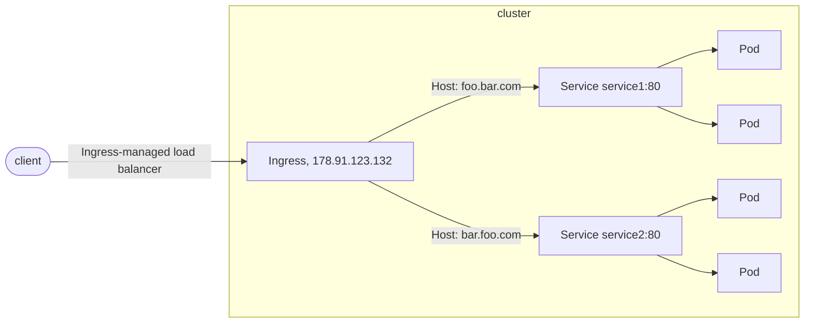

# Giới thiệu

`Ingress` dùng để khắc phục các hạn chế của `NodePort`

- Các service ứng dụng sẽ được expose dưới dạng `ClusterIP` và sau đó được expose ra bên ngoài qua `Ingress` --> Service thực sự trong suốt với người dùng. Người dùng chỉ thực sự kết nối tới `Ingress Controller`
- Có thể dùng thêm external LoadBalancer bên ngoài để trỏ tới IngressController --> Có thể sử dụng port http/https để kết nối tới domain tương ứng của service thay vì phải chỉ định thêm NodePort, nhìn nó chuyên nghiệp hơn hẳn
- Không bị hạn chế bởi số lượng Port mà NodePort có thể cung cấp.

`Ingress` mở và phân luồng các kết nối HTTP và HTTPS từ bên ngoài `Kubernetes Cluster` vào các `Services` bên trong `Cluster`.

Việc phân luồng dữ liệu này được quản lý bởi các "rule" được định nghĩa ở các tài nguyên `Ingress` trên `Kubernetes`.

Việc thực thi phân luồng dữ liệu được thực hiện bởi `Ingress Controller`, là một `opensource` cài đặt trên `Kubernetes`.

Nhiệm vụ của `Ingress Controller` là nạp các thông tin của các I`ngress Resource` để thực hiện phân luồng.

Dưới đây là một ví dụ đơn giản trong đó `Ingress` gửi tất cả lưu lượng truy cập của mình đến một `Service`



`Ingress` có thể được định cấu hình để cung cấp cho Service các URL có thể truy cập bên ngoài, lưu lượng cân bằng tải, chấm dứt SSL / TLS và cung cấp dịch vụ lưu trữ ảo dựa trên tên.

Bộ điều khiển `Ingress` chịu trách nhiệm thực hiện `Ingress`, thường là với bộ cân bằng tải, mặc dù nó cũng có thể định cấu hình bộ định tuyến biên của bạn hoặc các giao diện người dùng bổ sung để giúp xử lý lưu lượng.

`Ingress` không hiển thị các cổng hoặc giao thức tùy ý. 

Việc hiển thị các services không phải HTTP và HTTPS với internet thường sử dụng 1 trong 2 loại service: `Service.Type=NodePort` hoặc `Service.Type=LoadBalancer`

---
# Cơ chế hoạt động

Cơ chế hoạt động của `Ingress` gồm 2 thành phần chính:

- `Ingress Controller`: Là thành phần điều khiển chính làm nhiệm vụ điều hướng các request tới các service bên trong `Kubernetes`. Thường thì Ingress Controller được cài đặt trên `Kubernetes` và được expose ra ngoài dưới dạng `NodePort`.
- `Ingress Rule`: Là một tài nguyên trên `Kubernetes`. Nó chứa nội dung khai báo rule để điều hướng từ một request tới một service cụ thể trên trong `Kubernetes`.

**NOTE**: Có nhiều `Ingress Controller` từ các nhà phát triển khác nhau có thể lựa chọn để cài đặt. Ngoài ra `Kubernetes` cũng hỗ trợ cài đặt nhiều `Ingress Controller` tùy nhu cầu sử dụng.

---
# Cấu trúc

`Ingress` là một tài nguyên ở mức `Namespace` trên `Kubernetes`.

Và giống như các tài nguyên khác như `Pod`, `Deployment` hay `Service`, ta có thể định nghĩa nó bằng cách sử dụng file manifest dạng `yaml`.

Ví dụ


```yaml
apiVersion: networking.k8s.io/v1
kind: Ingress
metadata:
  name: minimal-ingress
  annotations:
    nginx.ingress.kubernetes.io/rewrite-target: /
spec:
  ingressClassName: nginx-example
  rules:
  - http:
      paths:
      - path: /testpath
        pathType: Prefix
        backend:
          service:
            name: test
            port:
              number: 80
```


## Ingress Controller

No|Technology
---|---
1|nginx
2|contour
3|haproxy
4|treafik
5|istio
6|

```yaml
apiVersion: v1
kind: ConfigMap
metadata:
  name: nginx-configuration
```

```yaml
apiVersion: extensions/v1beta1
kind: Deployment
metadata:
  name: nginx-ingress-controller
spec:
  replicas: 1
  selector:
    matchLabels:
      name: nginx-ingress
  template:
    metadata:
      labels:
        name: nginx-ingress
    spec:
      containers:
        - name: nginx-ingress-controller
          image: quay.io/kubernetes-ingress-controller/nginx-ingress-controller:0.21.0
      args:
        - /nginx-ingress-controller
        - --configmap=$(POD_NAMESPACE)/nginx-configuration
      env:
        - name: POD_NAME
          valueFrom:
            fieldRef:
              fieldPath: metadata.name
        - name: POD_NAMESPACE
          valueFrom:
            fieldRef:
              fieldPath: metadata.namespace
      ports:
        - name: http
          containerPort: 80
        - name: https
          containerPort: 443
```

```yaml
apiVersion: v1
kind: Service
metadata:
  name: nginx-ingress
spec:
  type: NodePort
  selector:
    name: nginx-ingress
  ports:
    - name: http
      port: 80
      targetPort: 80
      protocol: TCP
    - name: https
      port: 443
      targetPort: 443
      protocol: TCP
```

```yaml
apiVersion: v1
kind: ServiceAccount
metadata:
  name: nginx-ingress-serviceaccount
```


## Ingress Resources

### Rule 1




```yaml
apiVersion: networking.k8s.io/v1
kind: Ingress
metadata:
  name: ingress-demo
spec:
  rules:
    - http:
        paths:
          - path: "/wear"
            pathType: Prefix
            backend:
              service:
                name: wear-service
                port:
                  number: 80
```

### Rule 2



```yaml
apiVersion: networking.k8s.io/v1
kind: Ingress
metadata:
  name: ingress-demo
spec:
  rules:
    - http:
        paths:
          - path: /wear
            pathType: Prefix
            backend:
              service:
                name: wear-service
                port:
                  number: 80
          - path: /watch
            pathType: Prefix
            backend:
              service:
                name: watch-service
                port:
                  number: 80
          - path: /listen
            pathType: Prefix
            backend:
              service:
                name: listen-service
                port:
                  number: 80
```

### Rule 3



```yaml
apiVersion: networking.k8s.io/v1
kind: Ingress
metadata:
  name: ingress-demo
spec:
  rules:
    - host: wear.demo.com
      http:
        paths:
          - path: "/returns"
            pathType: Prefix
            backend:
              service:
                name: returns-service
                port:
                  number: 80
          - path: "/support"
            pathType: Prefix
            backend:
              service:
                name: support-service
                port:
                  number: 80
    - host: watch.demo.com
      http:
        paths:
          - path: "/movies"
            pathType: Prefix
            backend:
              service:
                name: returns-service
                port:
                  number: 80
          - path: "/tv"
            pathType: Prefix
            backend:
              service:
                name: support-service
                port:
                  number: 80
```

### Rule 4: Simple fanout



```yaml
apiVersion: networking.k8s.io/v1
kind: Ingress
metadata:
  name: ingress-demo
spec:
  rules:
    - host: foo.bar.com
      http:
        paths:
          - path: "/foo"
            pathType: Prefix
            backend:
              service:
                name: service1
                port:
                  number: 4200
          - path: "/bar"
            pathType: Prefix
            backend:
              service:
                name: service2
                port:
                  number: 8080
```

### Rule 5: Ingress Name Based Virtual hosting



```yaml
apiVersion: networking.k8s.io/v1
kind: Ingress
metadata:
  name: ingress-demo
spec:
  rules:
    - host: foo.bar.com
      http:
        paths:
          - path: "/"
            pathType: Prefix
            backend:
              service:
                name: service1
                port:
                  number: 80
    - host: bar.foo.com
      http:
        paths:
          - path: "/"
            pathType: Prefix
            backend:
              service:
                name: service2
                port:
                  number: 80
```

### Rule 6: With TLS

```yaml
apiVersion: v1
kind: Secret
metadata:
  name: testsecret-tls
  namespace: default
type: kubernetes.io/tls
data:
  tls.crt: base64 encoded cert
  tls.key: base64 encoded key
```

```yaml
apiVersion: networking.k8s.io/v1
kind: Ingress
metadata:
  name: ingress-demo
spec:
  rules:
    - hosts:
        - https-example.com
      secretName: testsecret-tls
  rules:
    - host: https-example.com
      http:
        paths:
          - path: "/"
            pathType: Prefix
            backend:
              service:
                name: service1
                port:
                  number: 80
```

